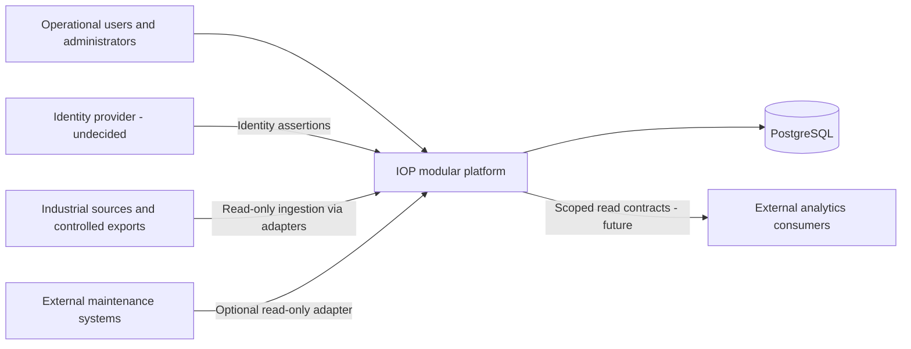

# System context

Operators, technicians and supervisors use IOP for operational context, handovers,
maintenance, asset lookup and analytics. Administrators manage customer/site
configuration and scoped access. These are user personas, not a decided role set.

Arrows describe logical information flow, not network initiation or a selected
protocol. Web, API and worker are internal host candidates; their deployment
relationship is undecided. External BI consumption is an extension point, not a
mandatory v1 dependency.

## Integration boundary

WinCC/event exports are historical candidate inputs. The source's actual
version, interface, licensing, access method and data grain require discovery.
CSV, documented read-only SQL views, historians and official APIs/protocols are
options, not promises of supported connectors. No source connectivity exists yet.

Adapters capture source provenance and translate local names and schemas.
Preserve an existing customer export/BI flow during any future migration until
reconciliation succeeds; IOP does not assume the historical `public.hitliste`
table or Power BI is present in every deployment.

## Trust and ownership

- Identity comes through Authentication; Users/RBAC decides scoped permissions.
- Customer context must be verified for reads, writes, searches, jobs and exports.
- Industrial systems remain outside the application trust boundary. Future
  connections use approved read-only access and an agreed OT/IT network path.
- Credentials, production exports and customer plans are deployment data, never
  repository fixtures. Synthetic fixtures can be designed during implementation.
- PostgreSQL holds platform-owned relational data. Storage for map files and RAW
  payloads, retention and network placement are still open.
